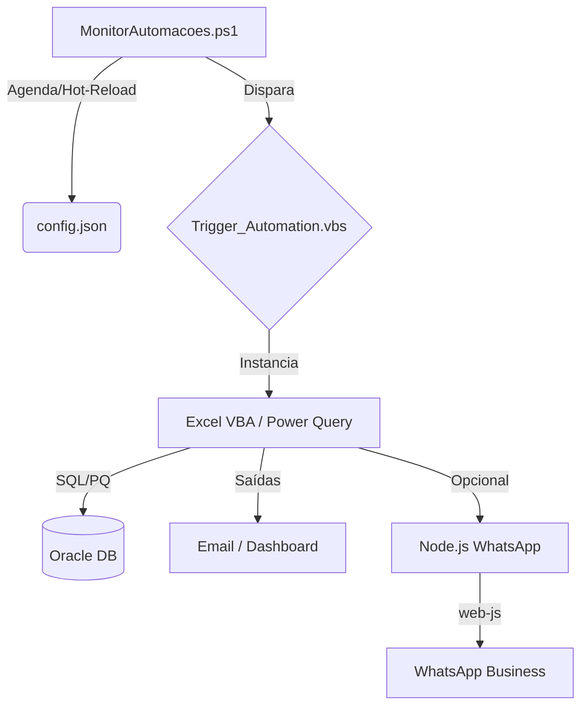

# Central de Automações (Automacoes Hub)

Este repositório é o núcleo técnico para orquestração de automações fiscais e operacionais. Utiliza um modelo **Monitor-Trigger-Action** para garantir execução resiliente, logs centralizados e monitoramento em tempo real.

## 🏗️ Arquitetura Técnica



---

## 🚀 Módulos de Automação

### 1. **Montagem de Terceirizados** (Robô Fiscal v8.8.0)

- **Objetivo**: Validação fiscal determinística de ordens de montagem externa.
- **Frequência**: Segunda a Sexta, de hora em hora.
- **Core Business**:
  - **Refresh Deterministico**: Através da coluna `VALIDA_ATUALIZACAO` no Oracle, o robô garante que os dados foram efetivamente renovados antes de prosseguir.
  - **Validação NF/OB**: Cruzamento de dados de notas fiscais e ordens de fabricação (OBs).
  - **Telemetria**: Registro de tempo de conexão, processamento e envio de indicadores.
- **Tecnologia**: Excel/VBA, Power Query, Oracle SQL.

### 2. **Receitas Bloqueadas**

- **Objetivo**: Processamento de receitas retidas e distribuição multicanal.
- **Frequência**: Segunda a Sexta, às 07:30 e 15:30.
- **Core Business**:
  - **Distribuição Híbrida**: Envio concomitante via E-mail (HTML) e WhatsApp.
  - **WhatsApp Gateway**: Utiliza Node.js (`whatsapp-web.js`) com sistema de idempotência para evitar envios duplicados.
  - **Sessão Resiliente**: Gestão de autenticação estável com fallback para pareamento manual se necessário.
- **Tecnologia**: Excel/VBA, Power Query, Node.js, WhatsApp API.

### 3. **Receitas Emitidas**

- **Objetivo**: Controle semanal para conferência física na Cozinha de Químicos.
- **Frequência**: Sextas-feiras às 07:05.
- **Core Business**:
  - **Agrupamento por Máquina**: Relatório compacto gerado via Tabela Dinâmica e convertido para HTML otimizado para Outlook.
  - **Destinatarios configuraveis**: Aba `Config` com tabela `EnderecosEmail` (coluna Para/To/Destinatario).
  - **Interface**: Destinado à equipe operacional (Cozinha).
- **Tecnologia**: Excel/VBA, Power Query.

---

## 🛠️ Operação e Monitoramento

### Monitor Central (`MonitorAutomacoes.ps1`)

- Executa em background controlado por um **Mutex** global, com tentativa de aquisição por até **5 segundos** para evitar espera indefinida no startup.
- Em caso de mutex abandonado (encerramento abrupto da instância anterior), o monitor assume o controle de forma segura e continua a execução.
- **Hot-Reload**: Alterações no `config.json` são detectadas por hash (**SHA-256**) e aplicadas sem reinício.
- **Resiliência de Configuração**: Em caso de leitura inválida/transiente do `config.json`, o monitor tenta recarregar até 3 vezes antes de manter a configuração anterior.
- **Diagnóstico de Startup**: Falhas de inicialização (mutex e carga inicial da configuração) são registradas em `C:\Automacoes\Startup_Error.txt`.
- **Validação de Contrato**: O monitor valida caminhos absolutos, tipos booleanos e faixas numéricas de agenda (`daysOfWeek 0-6`, `hours 0-23`, `minutes 0-59`).
- **Heartbeat Operacional**: O heartbeat consolida contadores acumulados e também métricas por janela de 1 hora (disparos, conclusões e não-zero).
- **Snapshot de Métricas**: O monitor persiste `C:\Automacoes\Logs\Monitor_Metrics.json` com os blocos `cumulative` (acumulado) e `window` (janela operacional reiniciada a cada heartbeat), além de referência ao snapshot anterior para comparação entre reinícios.
- **Logs Consolidados**: Localizados em `C:\Automacoes\Logs\yyyy-MM_Monitor.log`.

Modo seguro para validacao de startup/metricas (sem disparar tarefas):

```powershell
powershell -NoProfile -ExecutionPolicy Bypass -File C:\Automacoes\MonitorAutomacoes.ps1 -RunOnce -SkipTaskExecution -MutexNameOverride "Global\MonitorAutomacoesMutex-SmokeTest"
```

Modo DryRun para validar agenda real sem executar scripts (loga apenas o que seria disparado):

```powershell
powershell -NoProfile -ExecutionPolicy Bypass -File C:\Automacoes\MonitorAutomacoes.ps1 -RunOnce -DryRun -MutexNameOverride "Global\MonitorAutomacoesMutex-DryRun"
```

### Contrato de Agendamento (`config.json`)

- `schedule.daysOfWeek`: filtro opcional de dias da semana (`0` a `6`).
- `schedule.hours`: filtro opcional de horas (`0` a `23`). Quando vazio (`[]`), significa **sem filtro por hora**.
- `schedule.minutes`: filtro obrigatório de minutos (`0` a `59`).

### Auditoria de Arquivos XLSM

Para revisar metadados de workbooks binarios em texto versionavel, use:

```powershell
powershell -ExecutionPolicy Bypass -File C:\Automacoes\Tools\ExportarAuditoriaXlsm.ps1
```

Resultado padrao:

- `C:\Automacoes\Audit\xlsm\index.json`
- `C:\Automacoes\Audit\xlsm\...\manifest.json`

### Politica de Retencao Automatizada

O monitor executa diariamente a tarefa `Retencao Arquivos` (02:20) para reduzir artefatos temporarios sem impactar o estado critico das automacoes.

Escopo padrao:

- Logs antigos (`*.log`) em `Logs/` e subpastas operacionais.
- Auditoria antiga em `Audit/` por data de modificacao.
- Cache pesado da sessao WhatsApp (`.wwebjs_auth`) em diretorios de cache regeneraveis.

Janelas padrao de retencao:

- `KeepLogsDays=7`
- `KeepBootstrapDays=15`
- `KeepAuditDays=30`

Script usado:

```powershell
powershell -ExecutionPolicy Bypass -File C:\Automacoes\Tools\AplicarPoliticaRetencao.ps1
```

Validacao sem alterar arquivos (dry-run):

```powershell
powershell -ExecutionPolicy Bypass -File C:\Automacoes\Tools\AplicarPoliticaRetencao.ps1 -DryRun
```

### Tabela de Erros Padronizada

| Código  | Descrição                                           |
| :------ | :-------------------------------------------------- |
| **0**   | Sucesso                                             |
| **1-3** | Falha de Arquivo ou Ambiente                        |
| **4**   | Falha interna na Macro VBA                          |
| **5**   | Timeout (Oracle/Processamento)                      |
| **6**   | Erro Fatal reportado pela lógica de negócio         |
| **7**   | Workbook bloqueado (aberto em modo somente leitura) |
| **23**  | Bridge WhatsApp em cooldown de retry (envio adiado) |
| **40**  | Execução concorrente bloqueada no bridge WhatsApp   |

---

## 📏 Padrões de Desenvolvimento

1. **Codificação**: Todo código VBA (`.bas`) deve seguir o padrão **ANSI (Windows-1252)** via skill `vba-vbe-ansi`.
2. **Entrada**: O ponto de entrada obrigatório é o script `Trigger_Automation.vbs` dentro de cada módulo.
3. **Logs Localizados**: Cada módulo deve manter logs internos detalhados na subpasta `Logs/` para diagnóstico profundo.
4. **Logs Separados**: `Execution.log` para VBS e `VBA_Internal.log` para o log de VBA quando há monitoramento por leitura de log.

### Validação Pré-Commit (PowerShell)

Para evitar nomes de função com verbos fora do padrão do PowerShell, o repositório inclui:

- Hook Git: `.githooks/pre-commit`
- Validador: `Tools/Test-PowerShellApprovedVerbs.ps1`

O validador bloqueia commit quando encontrar:

- Nome de função fora do padrão `Verbo-Substantivo` (sem hífen, por exemplo)
- Verbo não aprovado pela lista oficial do PowerShell (`Get-Verb`)

Ative os hooks localmente uma única vez:

```bash
git config core.hooksPath .githooks
```

Execução manual opcional:

```powershell
pwsh -NoProfile -ExecutionPolicy Bypass -File .\Tools\Test-PowerShellApprovedVerbs.ps1
```

Guia de nomenclatura: `docs/padroes-nomenclatura-powershell.md`.

### Governança PT-BR (VBA ASCII-safe)

Para validar governança de texto PT-BR mantendo ASCII no VBE:

```powershell
pwsh -NoProfile -ExecutionPolicy Bypass -File .\Tools\ValidarAutomacoes.ps1 -OnlyGovernance
```

Modo strict (também reprova termos de UI sem acentuação adequada):

```powershell
pwsh -NoProfile -ExecutionPolicy Bypass -File .\Tools\ValidarAutomacoes.ps1 -OnlyGovernance -FailOnTermWarnings
```

Validador dedicado:

- `Tools/Test-VbaPtBrGovernance.ps1`
- Reprova quando encontrar non-ASCII em `.bas/.cls/.frm`
- Emite warning para termos PT-BR sem acentuação em contexto visível ao usuário

---

Mantido pela equipe de Automações & Antigravity AI
