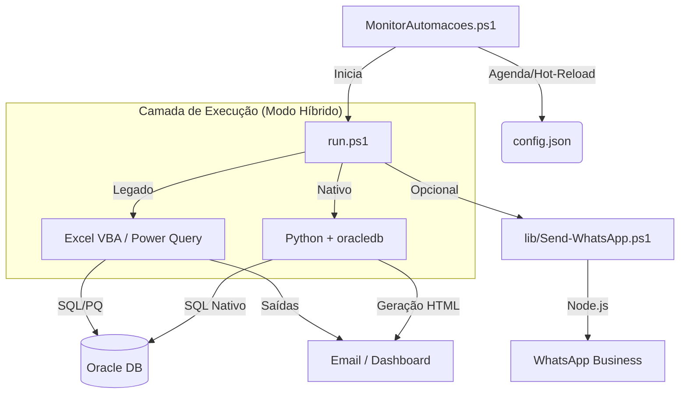

# Central de Automações (Automacoes Hub)

Este repositório é o núcleo técnico para orquestração de automações fiscais e operacionais. Utiliza um modelo **Monitor-Trigger-Action** para garantir execução resiliente, logs centralizados e monitoramento em tempo real.

O projeto está em transição de uma arquitetura baseada em Excel/VBA para uma **Arquitetura Nativa (Python + PowerShell)**, visando maior performance, segurança e independência de softwares de interface.

## 🏗️ Arquitetura Técnica

---

## 🚀 Módulos de Automação

### 1. **Receitas Emitidas** (Nativo v2.1.0) 🌟

- **Status**: **100% Migrado (VBA-Free)**.
- **Objetivo**: Controle semanal para conferência física na Cozinha de Químicos.
- **Frequência**: Sextas-feiras às 07:05.
- **Diferencial Nativo**:
    - **Performance**: Execução em ~7 segundos (redução de 90%).
    - **Arquitetura IPC**: Comunicação via Stdio Pipes (memória ram), sem arquivos temporários.
    - **Identidade Visual**: E-mails com assinatura oficial e fontes nativas do Outlook.
- **Tecnologia**: Python, PowerShell, Oracle SQL.

### 2. **Montagem de Terceirizados** (Robô Fiscal v8.8.0)

- **Status**: Legado (Candidato à migração).
- **Objetivo**: Validação fiscal determinística de ordens de montagem externa.
- **Core Business**: Refresh determinístico e cruzamento NF/OB.
- **Tecnologia**: Excel/VBA, Power Query, Oracle SQL.

### 3. **Receitas Bloqueadas**

- **Status**: Híbrido.
- **Objetivo**: Processamento de receitas retidas e distribuição multicanal (Email/WhatsApp).
- **Tecnologia**: Excel/VBA, Power Query, Node.js.

---

## 🛠️ Operação e Monitoramento

### Monitor Central (`MonitorAutomacoes.ps1`)

- Executa em background controlado por um **Mutex** global.
- **Hot-Reload**: Alterações no `config.json` aplicadas em tempo real via Hash SHA-256.
- **Segurança de Credenciais**: Utiliza arquivo `.env` na raiz (protegido por gitignore) injetado via variáveis de ambiente de processo.
- **Estado Operacional**: Dashboard visual em `C:\Automacoes\Dashboard\dashboard.html`.

### Tabela de Erros Padronizada

| Código  | Descrição                                           |
| :------ | :-------------------------------------------------- |
| **0**   | Sucesso                                             |
| **1-3** | Falha de Arquivo ou Ambiente                        |
| **4**   | Falha técnica (VBA ou Subprocesso Python)           |
| **5**   | Timeout (Oracle/Processamento)                      |
| **6**   | Erro Fatal reportado pela lógica de negócio         |
| **7**   | Arquivo bloqueado (Somente leitura)                 |
| **9**   | Falha de pré-requisitos de ambiente                 |

---

## 📏 Padrões de Desenvolvimento (Enterprise Stack)

O projeto segue a Skill `enterprise-local-automation-stack`:

1.  **Python**: PEP8 (Black Formatter), `snake_case`, bibliotecas em `requirements.txt`.
2.  **PowerShell**: Padrão `Verbo-Substantivo`, gestão rigorosa de objetos COM (Outlook).
3.  **Comunicação**: Preferencialmente via JSON em Stdio (Standard Input/Output) para evitar I/O desnecessário.
4.  **Segurança**: Proibido hardcode de senhas; uso obrigatório de `.env` ou Credential Manager.

---

Mantido pela equipe de Automações & Antigravity AI
