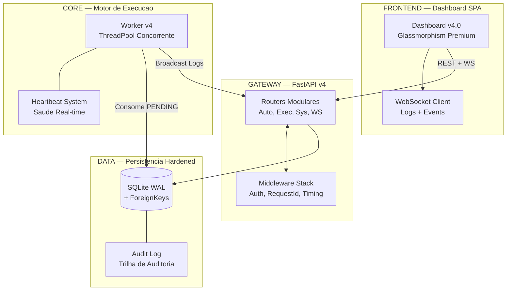

# Central de Automacoes (Hub Soberano) — v4.0.1 🚀

Este repositório é o núcleo soberano para orquestração de automações corporativas. O projeto atingiu o **Estado de Excelência v4.0.1**, operando com uma arquitetura modular enterprise, dashboard integrado e observabilidade total.

## 🏗️ Arquitetura Tecnica (Soberano Control Tower v4)

---

## 🚀 Modulos de Automacao (Estado de Excelencia)

### 1. [**Receitas Bloqueadas**](file:///c:/Automacoes/Receitas%20Bloqueadas/README.md) (Soberana v2.1.2) 🌟
- **Diferencial**: Idempotência estrita, geração de Excel analítico e alertas multicanal (Email/WhatsApp).
- **Frequência**: 07:00/30, 10:00/30 e 14:00/30.

### 2. [**Receitas Emitidas**](file:///c:/Automacoes/Receitas%20Emitidas/README.md) (Nativo v2.5.0) 🚀
- **Diferencial**: Comunicação via *IPC Stdio Pipes* em memória para ultra-performance.

### 3. [**Montagem de Terceirizados**](file:///c:/Automacoes/Montagem%20de%20Terceirizados/README.md) (Pure-Native v2.0) ⚙️
- **Diferencial**: Validação fiscal nativa direta no Oracle via Python (Thick Mode).

---

## 🛠️ Operacao e Monitoramento v4.0

- **Torre de Comando**: Dashboard reativo servido nativamente em `http://localhost:8766/dashboard/`.
- **Log Replay**: WebSocket inteligente que envia o histórico completo de logs ao conectar em uma execução ativa.
- **Worker v4**: Motor concorrente com **Heartbeat** (saúde ativa) e suporte a **Stop/Kill** real de processos.
- **Offline Ready**: Assets de interface (fonts/JS) servidos localmente para máxima estabilidade em redes isoladas.
- **Audit Log**: Toda ação administrativa (criação, edição, disparo) é registrada para auditoria técnica.

### Tabela de Erros e Diagnosticos (Protocolo v4)

| Codigo  | Descricao                                           | Acao do Hub               |
| :------ | :-------------------------------------------------- | :------------------------ |
| **0**   | Sucesso Absoluto                                    | Finaliza Ciclo            |
| **2**   | Sucesso: Idempotencia (Sem alteracoes)              | Finaliza Ciclo (Suprimido) |
| **3**   | Sucesso: Sem Dados Encontrados                      | Finaliza Ciclo            |
| **4**   | Erro Tecnico (Python/Node)                          | Alerta Multicanal + Audit |
| **9**   | Falha de Pre-Flight (Banco/OCI/Paths)               | **Trigger Retry (Fila)**  |
| **20**  | WhatsApp: Timeout de Inicializacao                  | Log Fatal + Alerta        |
| **TIMEOUT**| Execução excedeu tempo máximo                      | Taskkill Tree + Alerta    |

---

## 📏 Governanca (Padrao Ouro v4)
O projeto é auditado pelo **Protocolo V.A.L.E.G.** e blidado por:
1.  **Modular Routers**: API organizada por domínios (Automations, Executions, System, WS).
2.  **Schema Validation**: Proteção Pydantic contra Path Traversal e inputs maliciosos.
3.  **Timing-Safe Auth**: Proteção contra ataques de timing em toda a API.
4.  **WebSocket Event Bus**: Distribuição de eventos e logs com latência zero.

---

## 🧠 Gestão de Contexto (AI-Native)
Este arquivo é uma **unidade de contexto vital** v4.0.
- **Obrigação:** Deve ser atualizado imediatamente após qualquer alteração estrutural ou de regra de negócio.
- **Objetivo:** Manter a "memória central" sincronizada, garantindo que a IA opere com máxima precisão técnica.

---
Mantido pela equipe de Automacoes & Antigravity AI
