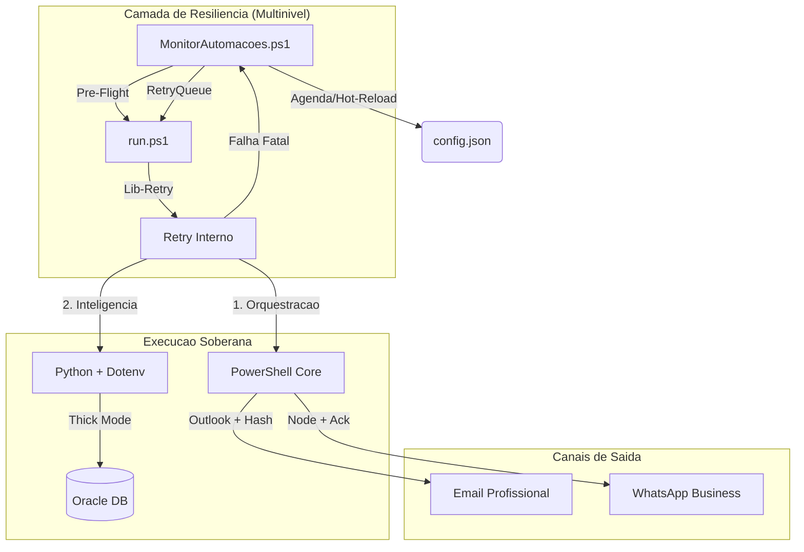

# Central de Automacoes (Automacoes Hub)

Este repositório é o núcleo técnico para orquestração de automações operacionais e fiscais. O projeto opera em **Arquitetura Soberana**, com 100% de modernização atingida e independência total de macros legadas.

## 🏗️ Arquitetura Tecnica (Nativa e Soberana)

---

## 🚀 Modulos de Automacao (Estado de Excelencia)

### 1. [**Receitas Bloqueadas**](file:///c:/Automacoes/Receitas%20Bloqueadas/README.md) (Soberana v2.1.2) 🌟
- **Diferencial**: Idempotência estrita em ambos os canais (E-mail/WhatsApp). Geração de Excel analítico formatado (PT-BR) via `openpyxl`.
- **Frequência**: 07:00/30, 10:00/30 e 14:00/30.

### 2. [**Receitas Emitidas**](file:///c:/Automacoes/Receitas%20Emitidas/README.md) (Nativo v2.5.0) 🚀
- **Diferencial**: Comunicação via *IPC Stdio Pipes* em memória.

### 3. [**Montagem de Terceirizados**](file:///c:/Automacoes/Montagem%20de%20Terceirizados/README.md) (Pure-Native v2.0) ⚙️
- **Diferencial**: Validação fiscal nativa direta no Oracle via Python.

---

## 🛠️ Operacao e Monitoramento

- **Dashboard Principal**: Acompanhe o estado em tempo real em [dashboard.html](file:///c:/Automacoes/Dashboard/dashboard.html).
- **Bibliotecas**: [Documentacao das Libs Compartilhadas](file:///c:/Automacoes/lib/README.md).
- **Historico de Incidentes**: Auditoria de falhas passadas em [incident-log.md](file:///c:/Automacoes/docs/incident-log.md).

### Tabela de Erros e Diagnosticos (Protocolo de Estabilidade)

| Codigo  | Descricao                                           | Acao do Monitor           |
| :------ | :-------------------------------------------------- | :------------------------ |
| **0**   | Sucesso Absoluto                                    | Finaliza Ciclo            |
| **1-3** | Falha de Ambiente ou Caminho                        | Log Fatal                 |
| **4**   | Erro Tecnico (Python/Node)                          | Log Fatal + Alerta E-mail |
| **9**   | Falha de Pre-Flight (Banco/OCI/Paths)               | **Trigger Retry (Fila)**  |
| **20**  | WhatsApp: Timeout de Inicializacao                  | Log Fatal                 |
| **23/40**| WhatsApp: Cooldown/Lock (Previsto)                 | Ignora Retry              |
| **24**  | WhatsApp: Falha de Entrega (Ack nao recebido)       | Log Fatal                 |
| **21**  | WhatsApp: Reautenticacao Necessaria                 | Log Fatal                 |

---

## 📏 Governanca (Padrao Ouro)
O projeto é auditado automaticamente em cada commit:
1.  **Protocolo V.A.L.E.G.**: Conformidade absoluta (Validação, Arquitetura, Logging, Escala e Governança).
2.  **Zero Trust**: Credenciais apenas em `.env`.
3.  **Sintaxe JSON**: Todos os configs validados pelo `Test-JsonConfig.ps1`.
4.  **ASCII-Safe**: Codigo-fonte imune a corrupcao de encoding.
5.  **Portabilidade**: Proibido caminhos absolutos (`C:\...`).

---

## 🧠 Gestão de Contexto (AI-Native)
Este arquivo é uma **unidade de contexto vital** para a IA. 
- **Obrigação:** Deve ser atualizado imediatamente após qualquer alteração estrutural, de regra de negócio ou de arquitetura no Hub.
- **Objetivo:** Manter a "memória central" do projeto sincronizada, garantindo que a IA carregue o contexto correto e economize tokens ao evitar a leitura exaustiva de código-fonte.

---
Mantido pela equipe de Automacoes & Antigravity AI
