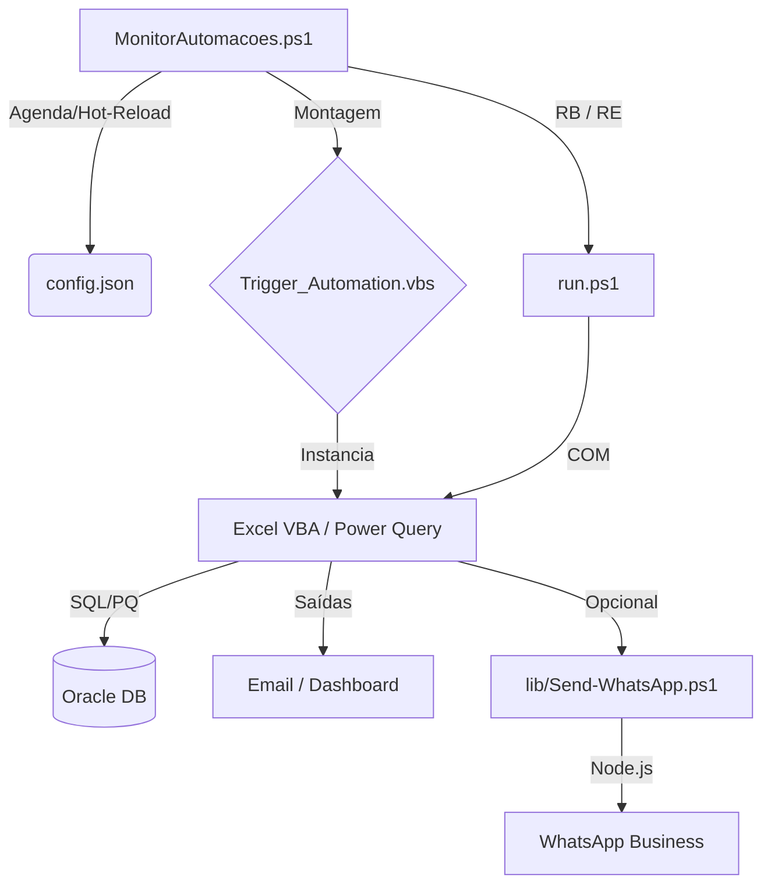

# Central de Automações (Automacoes Hub)

Este repositório é o núcleo técnico para orquestração de automações fiscais e operacionais. Utiliza um modelo **Monitor-Trigger-Action** para garantir execução resiliente, logs centralizados e monitoramento em tempo real.

## 🏗️ Arquitetura Técnica



---

## 🚀 Módulos de Automação

### 1. **Montagem de Terceirizados** (Robô Fiscal v8.8.0)

- **Objetivo**: Validação fiscal determinística de ordens de montagem externa.
- **Frequência**: Segunda a Sexta, de hora em hora.
- **Core Business**:
  - **Refresh Deterministico**: Através da coluna `VALIDA_ATUALIZACAO` no Oracle, o robô garante que os dados foram efetivamente renovados antes de prosseguir.
  - **Validação NF/OB**: Cruzamento de dados de notas fiscais e ordens de fabricação (OBs).
  - **Telemetria**: Registro de tempo de conexão, processamento e envio de indicadores.
- **Tecnologia**: Excel/VBA, Power Query, Oracle SQL.

### 2. **Receitas Bloqueadas**

- **Objetivo**: Processamento de receitas retidas e distribuição multicanal.
- **Frequência**: Segunda a Sexta, às 07:30 e 15:30.
- **Core Business**:
  - **Distribuição Híbrida**: Envio concomitante via E-mail (HTML) e WhatsApp.
  - **WhatsApp Gateway**: Utiliza Node.js (`whatsapp-web.js`) com sistema de idempotência para evitar envios duplicados.
  - **Sessão Resiliente**: Gestão de autenticação estável com fallback para pareamento manual se necessário.
- **Tecnologia**: Excel/VBA, Power Query, Node.js, WhatsApp API.

### 3. **Receitas Emitidas**

- **Objetivo**: Controle semanal para conferência física na Cozinha de Químicos.
- **Frequência**: Sextas-feiras às 07:05.
- **Core Business**:
  - **Agrupamento por Máquina**: Relatório compacto gerado via Tabela Dinâmica e convertido para HTML otimizado para Outlook.
  - **Destinatarios configuraveis**: Aba `Config` com tabela `EnderecosEmail` (coluna Para/To/Destinatario).
  - **Interface**: Destinado à equipe operacional (Cozinha).
- **Tecnologia**: Excel/VBA, Power Query.

---

## 🛠️ Operação e Monitoramento

### Monitor Central (`MonitorAutomacoes.ps1`)

- Executa em background controlado por um **Mutex** global, com tentativa de aquisição por até **5 segundos** para evitar espera indefinida no startup.
- Em caso de mutex abandonado (encerramento abrupto da instância anterior), o monitor assume o controle de forma segura e continua a execução.
- **Hot-Reload**: Alterações no `config.json` são detectadas por hash (**SHA-256**) e aplicadas sem reinício.
- **Resiliência de Configuração**: Em caso de leitura inválida/transiente do `config.json`, o monitor tenta recarregar até 3 vezes antes de manter a configuração anterior.
- **Diagnóstico de Startup**: Falhas de inicialização (mutex e carga inicial da configuração) são registradas em `C:\Automacoes\Startup_Error.txt`.
- **Validação de Contrato**: O monitor valida caminhos absolutos, tipos booleanos e faixas numéricas de agenda (`daysOfWeek 0-6`, `hours 0-23`, `minutes 0-59`).
- **Heartbeat Operacional**: O heartbeat consolida contadores acumulados e também métricas por janela de 1 hora (disparos, conclusões e não-zero).
- **Snapshot de Métricas**: O monitor persiste `C:\Automacoes\Logs\Monitor_Metrics.json` com os blocos `cumulative` (acumulado) e `window` (janela operacional reiniciada a cada heartbeat), além de referência ao snapshot anterior para comparação entre reinícios.
- **Logs Consolidados**: Localizados em `C:\Automacoes\Logs\yyyy-MM_Monitor.log`.

Modo seguro para validacao de startup/metricas (sem disparar tarefas):

```powershell
powershell -NoProfile -ExecutionPolicy Bypass -File C:\Automacoes\MonitorAutomacoes.ps1 -RunOnce -SkipTaskExecution -MutexNameOverride "Global\MonitorAutomacoesMutex-SmokeTest"
```

Modo DryRun para validar agenda real sem executar scripts (loga apenas o que seria disparado):

```powershell
powershell -NoProfile -ExecutionPolicy Bypass -File C:\Automacoes\MonitorAutomacoes.ps1 -RunOnce -DryRun -MutexNameOverride "Global\MonitorAutomacoesMutex-DryRun"
```

### Contrato de Agendamento (`config.json`)

- `schedule.daysOfWeek`: filtro opcional de dias da semana (`0` a `6`).
- `schedule.hours`: filtro opcional de horas (`0` a `23`). Quando vazio (`[]`), significa **sem filtro por hora**.
- `schedule.minutes`: filtro obrigatório de minutos (`0` a `59`).

### Auditoria de Arquivos XLSM

Para revisar metadados de workbooks binarios em texto versionavel, use:

```powershell
powershell -ExecutionPolicy Bypass -File C:\Automacoes\Tools\ExportarAuditoriaXlsm.ps1
```

Resultado padrao:

- `C:\Automacoes\Audit\xlsm\index.json`
- `C:\Automacoes\Audit\xlsm\...\manifest.json`

### Reenvio Forçado de Alertas (`ReenviarAlertaErros.ps1`)

Localizado em `Montagem de Terceirizados/`, força o reenvio do e-mail de alertas de erros NF sem refazer o refresh do Oracle. Útil quando a automação rodou mas o e-mail não foi disparado, ou quando se deseja renotificar sem aguardar o próximo ciclo agendado.

```powershell
# Padrão: apaga Cache_Estado_Detalhado.txt para tratar erros atuais como novos
pwsh -File "C:\Automacoes\Montagem de Terceirizados\ReenviarAlertaErros.ps1"

# Mantém cache: aplica lógica de delta normal (só notifica se houve mudança)
pwsh -File "C:\Automacoes\Montagem de Terceirizados\ReenviarAlertaErros.ps1" -KeepCache
```

| Exit Code | Significado                                                             |
| :-------- | :---------------------------------------------------------------------- |
| **0**     | E-mail enviado com sucesso, ou ignorado por idempotência                |
| **5**     | Macro concluída com erros VBA internos                                  |
| **6**     | Falha definitiva no envio do e-mail (todas as tentativas esgotadas)     |
| **7**     | Estado inalterado: nenhuma mudança detectada (execute sem `-KeepCache`) |
| **8**     | Macro concluída sem envio de e-mail detectado no log                    |
| **9**     | Macro não gerou as entradas esperadas no log                            |

### Politica de Retencao Automatizada

O monitor executa diariamente a tarefa `Retencao Arquivos` (02:20) para reduzir artefatos temporarios sem impactar o estado critico das automacoes.

Escopo padrao:

- Logs antigos (`*.log`) em `Logs/` e subpastas operacionais.
- Auditoria antiga em `Audit/` por data de modificacao.
- Cache pesado da sessao WhatsApp (`.wwebjs_auth`) em diretorios de cache regeneraveis.

Janelas padrao de retencao:

- `KeepLogsDays=7`
- `KeepBootstrapDays=15`
- `KeepAuditDays=30`

Script usado:

```powershell
powershell -ExecutionPolicy Bypass -File C:\Automacoes\Tools\AplicarPoliticaRetencao.ps1
```

Validacao sem alterar arquivos (dry-run):

```powershell
powershell -ExecutionPolicy Bypass -File C:\Automacoes\Tools\AplicarPoliticaRetencao.ps1 -DryRun
```

### Tabela de Erros Padronizada

| Código  | Descrição                                           |
| :------ | :-------------------------------------------------- |
| **0**   | Sucesso                                             |
| **1-3** | Falha de Arquivo ou Ambiente                        |
| **4**   | Falha interna na Macro VBA                          |
| **5**   | Timeout (Oracle/Processamento)                      |
| **6**   | Erro Fatal reportado pela lógica de negócio         |
| **7**   | Workbook bloqueado (aberto em modo somente leitura) |
| **23**  | Bridge WhatsApp em cooldown de retry (envio adiado) |
| **40**  | Execução concorrente bloqueada no bridge WhatsApp   |

---

## 🔧 Ferramentas de Manutenção

### Sincronização de Módulos VBA (`SincronizarProjetoVba.ps1`)

Importa arquivos `.bas/.cls` do repositório para dentro do workbook `.xlsm` via Excel COM. Inclui `Invoke-ActivateDataSheet`, que garante a aba de dados Oracle (`Análise Montagem de Facção`) como ativa antes do save, evitando persistência com aba auxiliar ativa.

```powershell
pwsh -File .\Tools\SincronizarProjetoVba.ps1 -XlsmPath "<caminho>.xlsm" -SourceDir "<pasta>" [-SharedDir ".\_Shared\VBA"]
```

### Exportação de Módulos VBA (`ExportarVbaModulos.ps1`)

Exporta módulos VBA do `.xlsm` para `.bas/.cls` no repositório (versionamento e auditoria).

### Auditoria e Drift VBA

- **`CompararVbaModulos.ps1`** — compara módulos do repositório com snapshots em `Audit/vba/` e gera `compare-report.json`.
- **`AtualizarVbaRepositorio.ps1`** — reimporta módulos de todos os workbooks rastreados pelos manifests em `Audit/vba/`.
- **`Test-VbaDrift.ps1`** — detecta divergência entre fonte staged e snapshot (invocado automaticamente pelo pre-commit hook).

### Scaffolding de Nova Automação (`New-Automation.ps1`)

Cria diretório, `Trigger_Automation.vbs` configurado e entrada em `config.json` para uma nova automação.

```powershell
pwsh -File .\Tools\New-Automation.ps1 -Name "Minha Automacao" -MacroName "ExecutarProcesso" `
    -XlsmName "MinhaAutomacao.xlsm" -DaysOfWeek "1,2,3,4,5" -Hours "8" -Minutes "0" [-WithWhatsApp] [-DryRun]
```

### Correção de Markdown (`Fix-MarkdownStyle.ps1`)

Padroniza formatação dos arquivos `.md` do repositório.

```powershell
pwsh -File .\Tools\Fix-MarkdownStyle.ps1           # aplica correções
pwsh -File .\Tools\Fix-MarkdownStyle.ps1 -DryRun   # lista sem alterar
```

### Biblioteca Compartilhada (`lib/`)

- **`lib/Lib-Logging.psm1`** — Módulo PS importado por `run.ps1` de todas as automações. Expõe `Write-AutomacaoLog`, `New-ExecId` e `Get-AutomacaoLogPath`. Garante o formato de log unificado `[dd/MM/yyyy HH:mm:ss] [PS] [LEVEL] [ExecId] mensagem`.
- **`lib/Send-WhatsApp.ps1`** — Wrapper PS-nativo para o bridge Node.js de WhatsApp. Modos `AUTO` (silencioso) e `PAIRING` (janela CMD para reautenticação). Exit codes específicos: 21=Reauth necessária, 22=Config inválida, 23=Cooldown, 40=Concorrência bloqueada.

### Módulos VBA Compartilhados (`_Shared/VBA/`)

Classes reutilizáveis entre automações: `ClsEmailComposerService.cls` e `ClsOutlookAdapter.cls`. São importadas via `-SharedDir` pelo `SincronizarProjetoVba.ps1` após os módulos locais, garantindo que a versão canônica sobrescreva cópias locais.

---

## 📏 Padrões de Desenvolvimento

1. **Codificação**: Todo código VBA (`.bas`) deve seguir o padrão **ANSI (Windows-1252)** via skill `vba-vbe-ansi`.
2. **Entrada**: O ponto de entrada é `Trigger_Automation.vbs` (legado, Montagem de Terceirizados) ou `run.ps1` (PowerShell nativo, Receitas Bloqueadas e Receitas Emitidas).
3. **Logs Localizados**: Cada módulo deve manter logs internos detalhados na subpasta `Logs/` para diagnóstico profundo.
4. **Log Unificado**: Cada automação mantém um único arquivo de log mensal (ex.: `Logs/Montagem.log`), com prefixo de camada em cada linha: `[VBS]`/`[PS]` para o orquestrador e `[VBA]` para a macro. O formato padrão é `[dd/MM/yyyy HH:mm:ss] [CAMADA] [LEVEL] [ExecId] mensagem`, garantido pela `lib/Lib-Logging.psm1` nos scripts PowerShell.

### Validação Pré-Commit

O hook `.githooks/pre-commit` executa quatro validadores em sequência:

| Validador                                | Propósito                                                                                                 |
| :--------------------------------------- | :-------------------------------------------------------------------------------------------------------- |
| `Tools/Test-PowerShellApprovedVerbs.ps1` | Bloqueia funções PS com verbo não aprovado pelo PowerShell ou fora do padrão `Verbo-Substantivo`          |
| `Tools/Test-VbaPtBrGovernance.ps1`       | Detecta caracteres non-ASCII em `.bas/.cls/.frm` e termos PT-BR sem acentuação visível ao usuário         |
| `Tools/Test-VbaDrift.ps1`                | Detecta arquivos VBA staged que divergem dos snapshots em `Audit/vba/` (edição sem reimportar no `.xlsm`) |
| `Tools/Test-LogConformidade.ps1`         | Rejeita formatos de log proibidos (data ISO em vez de `dd/MM/yyyy`, nomes de arquivo com data diária)     |

Ative os hooks localmente uma única vez:

```bash
git config core.hooksPath .githooks
```

Guia de nomenclatura: `docs/padroes-nomenclatura-powershell.md`.

### Governança PT-BR (VBA ASCII-safe)

Para validar governança de texto PT-BR mantendo ASCII no VBE:

```powershell
pwsh -NoProfile -ExecutionPolicy Bypass -File .\Tools\ValidarAutomacoes.ps1 -OnlyGovernance
```

Modo strict (também reprova termos de UI sem acentuação adequada):

```powershell
pwsh -NoProfile -ExecutionPolicy Bypass -File .\Tools\ValidarAutomacoes.ps1 -OnlyGovernance -FailOnTermWarnings
```

Validador dedicado:

- `Tools/Test-VbaPtBrGovernance.ps1`
- Reprova quando encontrar non-ASCII em `.bas/.cls/.frm`
- Emite warning para termos PT-BR sem acentuação em contexto visível ao usuário

---

Mantido pela equipe de Automações & Antigravity AI
