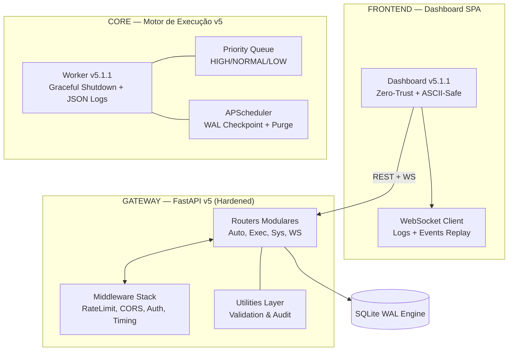

# Central de Automações — v5.1.1 Enterprise 🚀

Este repositório é o núcleo soberano para orquestração de automações corporativas. O projeto atingiu o **Estado de Excelência v5.1.1 Enterprise**, operando com arquitetura hardened, resiliência de escala (WAL Engine) e governança de segurança avançada Zero-Trust.

## 🏗️ Arquitetura Técnica (Enterprise Control Tower v5.1.1)

## 🎯 Novidades v5.4.0
- **UTF-8 Universal Encoding**: Adoção global do padrão UTF-8 para código-fonte e logs, abolindo as restrições de ASCII-Safe e Base64 Bridge para garantir máxima legibilidade humana e suporte nativo a PT-BR.
- **Zero-Trust Auth**: O Dashboard solicita a API Key dinamicamente, eliminando segredos no código.
- **Worker Resilience**: Encerramento limpo de processos PowerShell para evitar consumo de recursos zumbi.
- **Performance SQLite**: Pragmas otimizados para operação em RAM (`temp_store=MEMORY`).

---
Mantido pela equipe de Automações & Antigravity AI
