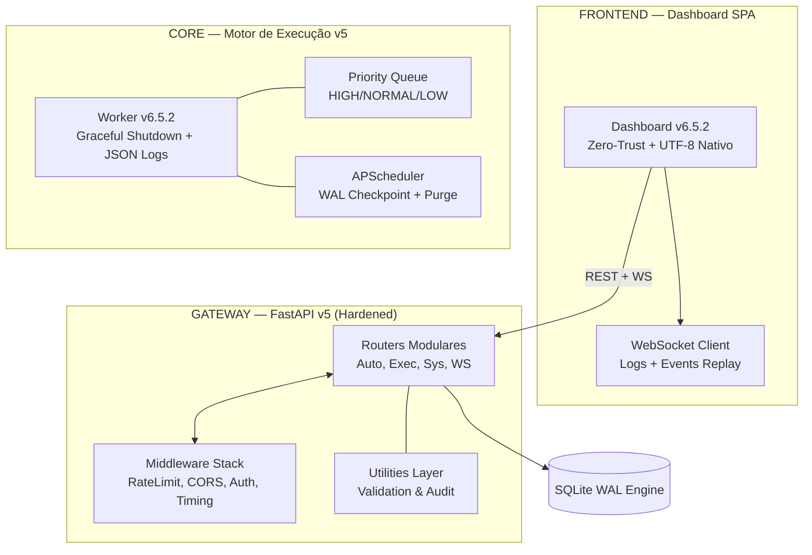

# Central de Automações — v6.5.2 Enterprise Operations

Este repositório é o núcleo soberano para orquestração de automações corporativas. O projeto opera no **Estado de Excelência v6.5.2**, com stack consolidada em Python, PowerShell e Node.js, governança Zero-Trust, observabilidade acionável e um conjunto compartilhado de skills para ChatGPT/Codex, Gemini CLI e Antigravity.

## 🏗️ Arquitetura Técnica (Enterprise Control Tower v6.5.2)

## 🎯 Estado Atual do Hub
- **UTF-8 Nativo Governado**: Código-fonte e logs operam em UTF-8, com PowerShell `.ps1`/`.psm1` em UTF-8 com BOM e demais arquivos textuais em UTF-8 sem BOM, conforme `GEMINI.md`.
- **Zero-Trust Auth**: O Dashboard solicita a API Key dinamicamente, eliminando segredos no código.
- **Observabilidade Acionável**: `/api/system/diagnostics` consolida saúde, fila, worker, scheduler, banco/WAL e achados com ação sugerida.
- **Console Operacional de Recovery**: Diagnósticos agora expõem impacto, prioridade, ação estruturada e atalhos para checkpoint, sincronização de agenda, wake-up/recovery e triagem de execuções.
- **Fila Operacional Auditável**: Execuções agora carregam `retry_count`, `max_retries`, `failure_reason`, `recovery_action` e `queue_group`, habilitando requeue seguro e rastreável.
- **Schema Evolutivo**: Startup aplica migrações leves de SQLite e mantém `schema_version` em metadados do próprio banco.
- **Validação Administrativa**: API expõe validação de `schedule` e `.env` antes de persistência.
- **Worker Resilience**: Encerramento limpo de processos PowerShell para evitar consumo de recursos zumbi.
- **Performance SQLite**: Pragmas otimizados para operação em RAM (`temp_store=MEMORY`).
- **Skills Compartilhadas**: `.github/skills/` e a fonte canonica das 6 skills ativas; `.gemini/skills/` e apenas o espelho de compatibilidade para Gemini CLI e Antigravity.

---
Mantido pela equipe de Automações & Antigravity AI
