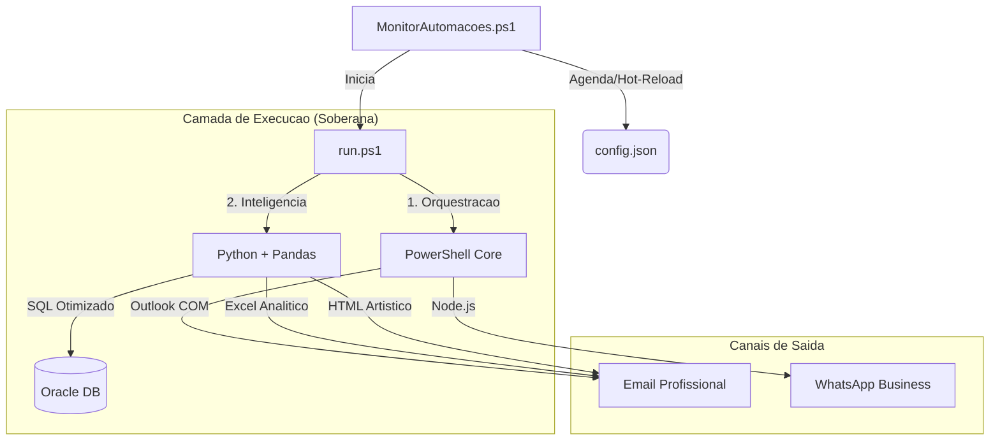

# Central de Automacoes (Automacoes Hub)

Este repositório é o núcleo técnico para orquestração de automações operacionais e fiscais. Após um ciclo intensivo de migração, o projeto atingiu **100% de modernização**, substituindo todo o legado Excel/VBA por uma arquitetura nativa de alta performance.

## 🏗️ Arquitetura Tecnica (Nativa)

---

## 🚀 Modulos de Automacao (Estado Atual)

### 1. **Receitas Bloqueadas** (Nativo v2.1.0) 🌟
- **Status**: **100% Nativo**.
- **Diferencial**: Inteligência de estado (Novas, Alteradas, Liberadas) via JSON, evitando spam. Envio de Excel formatado via `openpyxl` e WhatsApp via Node.js.
- **Terminologia**: Focado em Ordens de Beneficiamento (OB).

### 2. **Receitas Emitidas** (Nativo v2.5.0) 🚀
- **Status**: **100% Nativo**.
- **Diferencial**: Comunicação via *IPC Stdio Pipes* em memória (zero dependência de disco para troca de dados). Extração via Oracle CTE.

### 3. **Montagem de Terceirizados** (Native-First v1.2) ⚙️
- **Status**: **Modernizado**.
- **Diferencial**: Validação fiscal e geração de dashboard HTML dinâmico diretamente via Python.

---

## 🛠️ Operacao e Monitoramento

### Monitor Central (`MonitorAutomacoes.ps1`)
- Executa em background controlado por um **Mutex** global.
- **Pre-Flight Check**: Diagnóstico de saúde (Disco, Oracle Ping, Paths) antes de cada disparo.
- **Hot-Reload**: Alterações no `config.json` aplicadas em tempo real.
- **Dashboard**: Estado operacional visual em `Dashboard/dashboard.html`.

### Tabela de Erros Padronizada

| Codigo  | Descricao                                           |
| :------ | :-------------------------------------------------- |
| **0**   | Sucesso                                             |
| **1-3** | Falha de Arquivo ou Ambiente                        |
| **4**   | Falha tecnica (Python ou Node.js)                   |
| **20**  | WhatsApp: Timeout de Inicializacao                  |
| **21**  | WhatsApp: Reautenticacao Necessaria                 |
| **23**  | WhatsApp: Cooldown Ativo                            |
| **9**   | Falha Critica de Pre-Flight (Ambiente Inapropriado) |

---

## 📏 Padroes de Engenharia (Padrao Ouro)
O projeto é blindado por 8 SKILLs de governança:
1.  **Zero Trust**: Credenciais apenas em `.env`. Proibido hardcode.
2.  **Explicit SQL**: Proibido `SELECT *`. Consultas otimizadas e nominais.
3.  **Base64 Bridge**: Integridade total de caracteres PT-BR entre camadas.
4.  **Portabilidade**: Caminhos 100% dinâmicos/relativos.

---
Mantido pela equipe de Automacoes & Antigravity AI
