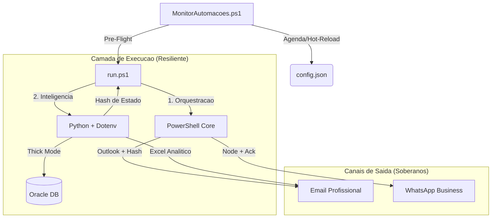

# Central de Automacoes (Automacoes Hub)

Este repositório é o núcleo técnico para orquestração de automações operacionais e fiscais. O projeto opera em **Arquitetura Soberana**, com 100% de modernização atingida e independência total de macros legadas.

## 🏗️ Arquitetura Tecnica (Nativa e Soberana)

---

## 🚀 Modulos de Automacao (Estado de Excelencia)

### 1. **Receitas Bloqueadas** (Soberana v2.1.1) 🌟
- **Diferencial**: Idempotência estrita em ambos os canais (E-mail/WhatsApp). Geração de Excel analítico formatado (PT-BR) via `openpyxl`.
- **Frequência**: 07:30, 10:00 e 14:00.

### 2. **Receitas Emitidas** (Nativo v2.5.0) 🚀
- **Diferencial**: Comunicação via *IPC Stdio Pipes* em memória.

### 3. **Montagem de Terceirizados** (Pure-Native v1.2) ⚙️
- **Diferencial**: Validação fiscal nativa direta no Oracle via Python.

---

## 🛠️ Operacao e Monitoramento

### Tabela de Erros e Diagnosticos

| Codigo  | Descricao                                           |
| :------ | :-------------------------------------------------- |
| **0**   | Sucesso Absoluto                                    |
| **1-3** | Falha de Ambiente ou Caminho                        |
| **4**   | Erro Tecnico (Python/Node)                          |
| **20**  | WhatsApp: Timeout de Inicializacao                  |
| **24**  | WhatsApp: Falha de Entrega (Ack nao recebido)       |
| **21**  | WhatsApp: Reautenticacao Necessaria                 |
| **9**   | Falha de Pre-Flight (Banco fora ou disco cheio)     |

---

## 📏 Governanca (Padrao Ouro)
O projeto é auditado automaticamente em cada commit:
1.  **Zero Trust**: Credenciais apenas em `.env`.
2.  **Sintaxe JSON**: Todos os configs validados pelo `Test-JsonConfig.ps1`.
3.  **ASCII-Safe**: Codigo-fonte imune a corrupcao de encoding.
4.  **Portabilidade**: Proibido caminhos absolutos (`C:\...`).

---
Mantido pela equipe de Automacoes & Antigravity AI
