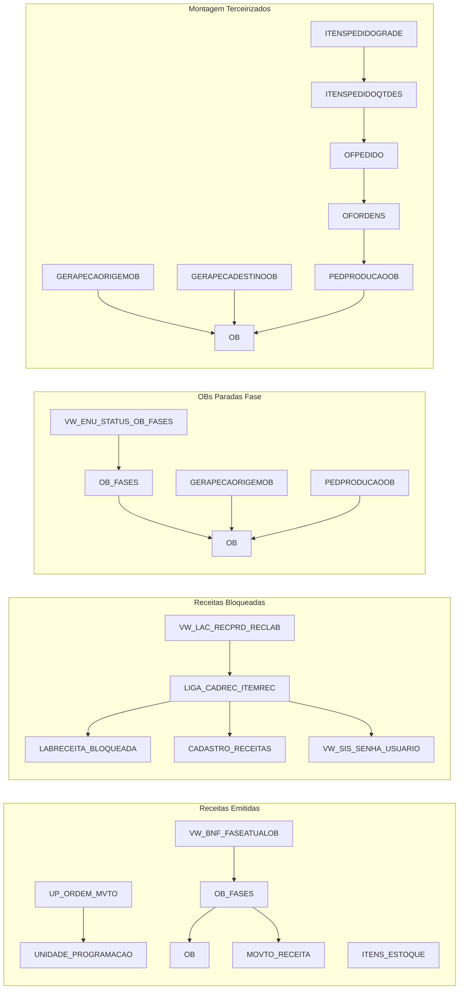

# Schema Graph — Oracle SGTPRD

> Curadoria humana sobre dados reais, verificados em 13/09/2026 via
> `Tools/build_oracle_catalog.py` + `Tools/oracle_catalog.py`.
> Mostra os objetos SGTPRD **usados pelas automações ativas** com suas relações.
> Para o subgrafo em JSON (mesmos objetos, formato programático) veja
> `core-graph.json`. Para o schema real completo (3.608 tabelas, 1.729 views),
> use o catálogo local — `Tools/oracle_catalog.py table/find/path/neighbors`.

---

## Grafo Geral por Domínio

```mermaid
graph TB
  subgraph Producao["🏭 Produção / Beneficiamento"]
    OB["OB\n177K linhas\nOrdens de Beneficiamento"]
    OB_FASES["OB_FASES\n1.3M linhas\nFases Produtivas"]
    OB_PRODUTO["OB_PRODUTO\n177K linhas\nProduto da OB"]
    UNIDADE_PROGRAMACAO["UNIDADE_PROGRAMACAO\n1.6M linhas\nUnidades de Programação"]
    UP_ORDEM_MVTO["UP_ORDEM_MVTO\n1.5M linhas\nMovimentação de Ordens"]
    FASES_FLUXO["FASES_FLUXO\n38 linhas\nCadastro de Fases"]
    VW_BNF_FASEATUALOB["VW_BNF_FASEATUALOB\n👁 Fase Atual da OB"]
    VW_ENU_STATUS_OB_FASES["VW_ENU_STATUS_OB_FASES\n👁 Status Legível"]
    VW_PI_CBPAP02_PRODBENEF["VW_PI_CBPAP02_PRODBENEF\n👁 Produção Beneficiamento"]
    VW_BNF_OB_FASES_UP["VW_BNF_OB_FASES_UP\n👁 Fases + UP"]
  end

  subgraph Pecas["🧵 Peças / Rastreabilidade"]
    GERAPECASPRODUTO["GERAPECASPRODUTO\n13.4M linhas\nCatálogo de Peças"]
    GERAPECAORIGEMOB["GERAPECAORIGEMOB\n5.1M linhas\nPeças de Entrada"]
    GERAPECADESTINOOB["GERAPECADESTINOOB\n5.1M linhas\nPeças de Saída"]
    GERAPECAPEDCOMERCIAL["GERAPECAPEDCOMERCIAL\n956 linhas\nPeça × Pedido Comercial"]
  end

  subgraph Qualidade["🧪 Qualidade / Receitas"]
    MOVTO_RECEITA["MOVTO_RECEITA\n1.3M linhas\nMovimentos de Receita"]
    CADASTRO_RECEITAS["CADASTRO_RECEITAS\n6.7K linhas\nMaster Receitas"]
    LIGA_CADREC_ITEMREC["LIGA_CADREC_ITEMREC\n6.7K linhas\nReceita × Lab"]
    LABRECEITA_BLOQUEADA["LABRECEITA_BLOQUEADA\n7.3K linhas\nBloqueios de Receita"]
    CLASSIFICACAO_COR["CLASSIFICACAO_COR\nEnum Classificações\n1=CLARA 6=BRANCO 9=BRANCO 2 FIBRAS"]
    VW_LAC_RECPRD_RECLAB["VW_LAC_RECPRD_RECLAB\n👁 Receitas Produção/Lab"]
    VW_EXC_OB_PROD_CLASS_COR["VW_EXC_OB_PROD_CLASS_COR\n👁 Classif. Cor por OB"]
    BENLOTEFINALIDADE["BENLOTEFINALIDADE\n30.7K linhas\nLotes Finalidade"]
    BENDETLOTEFINALIDADE["BENDETLOTEFINALIDADE\n61.5K linhas\nDetalhe Lotes"]
  end

  subgraph Cadastro["📦 Cadastro / Estoque"]
    ITENS_ESTOQUE["ITENS_ESTOQUE\n24.9K linhas\nMaster de Itens"]
    PESSOASFJ["PESSOASFJ\nPessoas e Fornecedores"]
    OPERADOR["OPERADOR\nOperadores"]
    BD_BAS_MASCPRODACAB["BD_BAS_MASCPRODACAB\nDecodificador de Produto"]
    VW_SIS_SENHA_USUARIO["VW_SIS_SENHA_USUARIO\n👁 Usuários"]
  end

  subgraph Comercial["💼 Comercial / Pedidos"]
    PEDPRODUCAOOB["PEDPRODUCAOOB\n197K linhas\nOB × Ped.Produção"]
    OFORDENS["OFORDENS\n188K linhas\nOrdens de Fabricação"]
    OFPEDIDO["OFPEDIDO\n152K linhas\nOF × Pedido"]
    ITENSPEDIDOQTDES["ITENSPEDIDOQTDES\n190K linhas\nQtdes Grade"]
    ITENSPEDIDOGRADE["ITENSPEDIDOGRADE\n190K linhas\nGrade Cor/Tam"]
    ITENSPEDIDOCOMERCIAL["ITENSPEDIDOCOMERCIAL\n190K linhas\nItens Pedido Comercial"]
  end

  subgraph Engenharia["⚙️ Engenharia"]
    ENG_PRODG_ACABADO["ENG_PRODG_ACABADO\nEspecif. Técnicas\nGramatura Largura"]
    MAQUINA["MAQUINA\n497 linhas\nMáquinas"]
    FASES_FLUXO
    VW_ENU_TIPO_DE_MAQUINAS_SETOR["VW_ENU_TIPO_DE_MAQUINAS_SETOR\n👁 Tipos de Máquina"]
  end

  %% FK edges - Produção
  OB_FASES -->|"NUMERO_OB (FK natural)"| OB
  OB_PRODUTO -->|"NUMERO_OB"| OB
  UP_ORDEM_MVTO -->|"NUMEROORDEMREAL = NUMERO_OB"| OB
  UP_ORDEM_MVTO -->|"NUMEROUP"| UNIDADE_PROGRAMACAO
  VW_BNF_FASEATUALOB -->|"VIEW_DEP"| OB_FASES
  VW_PI_CBPAP02_PRODBENEF -->|"VIEW_DEP"| OB_FASES
  VW_PI_CBPAP02_PRODBENEF -->|"VIEW_DEP"| OB
  VW_PI_CBPAP02_PRODBENEF -->|"VIEW_DEP"| VW_BNF_OB_FASES_UP
  VW_BNF_OB_FASES_UP -->|"VIEW_DEP"| OB_FASES

  %% FK edges - Peças
  GERAPECAORIGEMOB -->|"FK: NUMERO_OB"| OB
  GERAPECADESTINOOB -->|"FK: NUMERO_OB"| OB
  GERAPECAORIGEMOB -->|"FK: IDPECASPRODUTO"| GERAPECASPRODUTO
  GERAPECADESTINOOB -->|"FK: IDPECASPRODUTO"| GERAPECASPRODUTO
  GERAPECASPRODUTO -->|"FK: CODIGO_REDUZIDO_PROD"| ITENS_ESTOQUE
  GERAPECASPRODUTO -->|"FK: IDPESSOAFJESTOQUE"| PESSOASFJ
  GERAPECAPEDCOMERCIAL -->|"FK: IDPECASPRODUTO"| GERAPECASPRODUTO
  GERAPECAPEDCOMERCIAL -->|"FK: NUMERO_PEDIDO_COMERC"| ITENSPEDIDOCOMERCIAL

  %% FK edges - Qualidade
  OB_FASES -->|"NUMEROORDEMMOVIMENTO = NUMEROORDEM"| MOVTO_RECEITA
  MOVTO_RECEITA -->|"FK: IDOPE_PESAGEM"| OPERADOR
  LIGA_CADREC_ITEMREC -->|"ID_LABRECEITA_BLOQ"| LABRECEITA_BLOQUEADA
  BENDETLOTEFINALIDADE -->|"FK: IDLOTEFINALIDADE"| BENLOTEFINALIDADE
  VW_LAC_RECPRD_RECLAB -->|"VIEW_DEP"| UP_ORDEM_MVTO
  VW_LAC_RECPRD_RECLAB -->|"VIEW_DEP"| OB_FASES
  VW_EXC_OB_PROD_CLASS_COR -->|"VIEW_DEP"| OB
  VW_EXC_OB_PROD_CLASS_COR -->|"VIEW_DEP"| CLASSIFICACAO_COR

  %% FK edges - Comercial
  PEDPRODUCAOOB -->|"NUMEROOB = NUMERO_OB"| OB
  OFORDENS -->|"NUMEROPEDPRODUCAO"| PEDPRODUCAOOB
  OFPEDIDO -->|"NUMEROOF"| OFORDENS
  OFPEDIDO -->|"FK: IDITENSPEDIDOQTDES"| ITENSPEDIDOQTDES
  ITENSPEDIDOQTDES -->|"FK: IDITEMPEDGRADE"| ITENSPEDIDOGRADE
  ITENSPEDIDOGRADE -->|"FK: PEDIDO+ITEMPEDIDO"| ITENSPEDIDOCOMERCIAL
  ITENSPEDIDOCOMERCIAL -->|"FK: REDUZIDOITEM"| ITENS_ESTOQUE
```

---

## Grafo de Automações

---

## Legenda

| Símbolo | Significado |
|---------|-------------|
| `→ FK` | Foreign Key formal no Oracle |
| `→ VIEW_DEP` | View depende da tabela/view |
| `→ NATURAL_JOIN` | Join por campo (sem FK formal) |
| `👁` | View (não é tabela física) |
| Número em linhas | `num_rows` da última análise de estatísticas |
