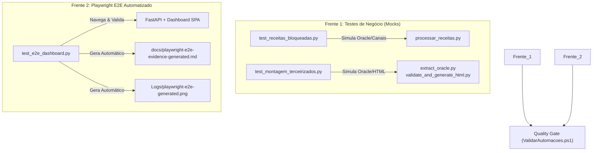

# Plano de Melhoria: Testabilidade de Robôs & Playwright E2E Automatizado

> **Versão do Plano:** v1.0.0 | **Data:** 20/05/2026
> **Alvo de Evolução:** Estado de Excelência v8.0.0
> **Responsáveis:** Antigravity AI & Gabriel Dias (USER)

Este documento formaliza o plano estratégico de melhoria contínua para o Hub de Automações. Ele detalha as diretrizes de arquitetura para testes automatizados nos robôs de negócio e a integração de um pipeline de validação de interface 100% autônomo.

---

## 🎯 Objetivos Estratégicos

1. **Garantir Isolamento Off-line:** Implementar testes unitários para as automações críticas (`Receitas Bloqueadas` e `Montagem de Terceirizados`), permitindo que a integridade do código seja testada sem acesso ao banco de dados Oracle de produção ou disparos de notificações reais.
2. **Eliminar Testagem Manual de UI:** Substituir a validação humana de navegação do Dashboard por testes E2E mecânicos usando Playwright em Python.
3. **Automatizar Evidências Documentais:** Gerar o relatório Markdown de conformidade de qualidade (`docs/playwright-e2e-*.md`) e screenshots dinamicamente a partir do sucesso da suíte de teste Playwright.

---

## 🏗️ Detalhamento das Frentes de Trabalho

### 1. Robustez com Mocks de Banco de Dados e Canais

Para possibilitar testes consistentes, as lógicas de negócio dos robôs serão desacopladas da camada de I/O externo:

- **Robô de Receitas Bloqueadas:**
  - O script `processar_receitas.py` terá suas lógicas encapsuladas em funções puras (ex: `processar_dataframe(df)`, `aplicar_filtros(dados)`).
  - Criaremos `Orchestrator/tests/test_receitas_bloqueadas.py` para testar estas funções. O acesso ao banco Oracle será mockado simulando cursores do `oracledb` / `cx_Oracle`.
  - O disparo de notificações (WhatsApp e E-mail) será capturado por mocks e validado sintaticamente, blindando e isolando a execução local.
- **Robô de Montagem de Terceirizados:**
  - O script `extract_oracle.py` e `validate_and_generate_html.py` receberão suite unitária `Orchestrator/tests/test_montagem_terceirizados.py`.
  - Validaremos a lógica de renderização do HTML de terceirizados contra regras estruturais e de CSS, prevenindo e-mails malformatados de forma estática.

### 2. Automação do Playwright E2E no CI/CD

Introduziremos o Playwright de forma limpa e isolada no repositório:

- **Banco de Testes Dedicado:** A suite E2E utilizará o banco de dados em memória ou arquivo temporário `test_automacoes_e2e.db`, pré-populado com automações conhecidas no `conftest.py`.
- **Validação de Interface Completa:** O script `test_e2e_dashboard.py` executará:
  - Login/Autenticação usando a API Key de testes.
  - Cliques de navegação entre os módulos (`Comando`, `Automações`, `Execuções`, `Sistema`).
  - Filtragem de execuções históricas.
  - Abertura de modal de logs e replay de log.
  - Verificação de logs de erros do navegador (se `window.errors` ou `console.error` dispararem, o teste falha).
- **Geração de Evidências Mecânicas:**
  - Ao concluir os testes E2E com aprovação de 100%, o script do Playwright usará a biblioteca Markdown do Python para criar o arquivo `docs/playwright-e2e-evidence-generated.md` com a exata data da validação, módulos navegados e as estatísticas de console.
  - O script salvará capturas de tela em formato de alta resolução em `Logs/playwright-e2e-generated.png`.

---

## 🚦 Critérios de Aceite e Qualidade

- **100% de Cobertura Off-line:** Os testes unitários dos robôs devem rodar e passar com a internet desconectada.
- **Sem Erros de Console:** Os testes do Playwright devem monitorar erros do console do navegador e falhar imediatamente caso haja qualquer exceção JS não tratada.
- **Conformidade de BOM e Encoding:** Todos os arquivos de testes criados e modificados seguirão estritamente a política de encoding do repositório (UTF-8 sem BOM para `.py` e `.md` e UTF-8 com BOM para `.ps1` e `.psm1`).
