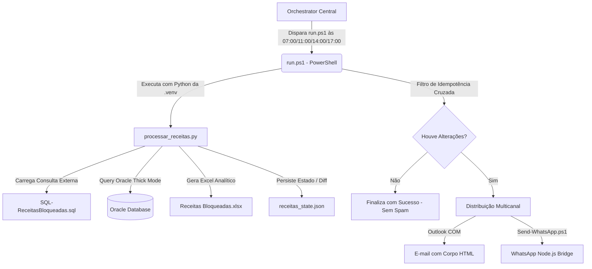

# Runbook Operacional: Receitas Bloqueadas (v2.1.2)

[⬅️ Voltar para o Hub Central](../../README.md)

> [!NOTE]
> Este é o runbook operacional oficial de missão crítica da automação **Receitas Bloqueadas**.
> Ele descreve os fluxos, dependências técnicas, criticidade, exit codes e procedimentos de recuperação do robô.

---

## 📋 Ficha Técnica e Metadados

* **Componente / Diretório:** `Receitas Bloqueadas` ([ir para pasta](../../Receitas%20Bloqueadas))
* **Criticidade:** ALTA / OPERACIONAL (Impacto no fluxo de produção da fiação e tecelagem)
* **SLA de Recuperação:** 3 horas
* **Horários de Disparo:** Segunda a Sexta-feira às **07:00**, **11:00**, **14:00** e **17:00**
* **Dono do Negócio (Product Owner):** Laboratório de Receitas e PCP (Planejamento e Controle de Produção)
* **Suporte Técnico / TI:** `suporte.automacoes@empresa.com`

---

## 🎯 Visão Geral e Impacto de Negócio

### O que esta Automação Faz?
O robô gerencia e notifica o fluxo de **Receitas de Produção Retidas** no banco Oracle (ERP/SGT) por ausência de insumos ou travamento do laboratório. O robô monitora as **Ordens de Beneficiamento (OB)** retidas e as classifica em:
1. ✨ **Novas:** Receitas bloqueadas detectadas pela primeira vez neste ciclo.
2. ⚠️ **Alteradas:** Receitas que sofreram alteração em campos críticos (como datas de liberação planejada).
3. ✅ **Liberadas:** Receitas que foram resolvidas pelo laboratório e liberadas no sistema Oracle.

O robô envia um relatório analítico em formato Excel via e-mail e dispara avisos operacionais formatados para o grupo de WhatsApp do PCP/Laboratório.

### Impacto de Parada (Risco Financeiro / Operacional)
Se esta automação falhar por mais de 4 horas:
* **Gargalo de Produção:** O PCP não é notificado sobre a liberação de OBs, atrasando o início de novos lotes de tingimento e tecelagem.
* **Falta de Insumos não Detectada:** Receitas continuam retidas sem ação corretiva do laboratório, provocando paradas em máquinas de tecelagem (custo de ociosidade fabril elevado).
* **Fadiga Operacional:** O laboratório terá que fazer a varredura manual de OBs no sistema Oracle repetidamente.

---

## 🛠️ Arquitetura e Dependências Técnicas

A automação segue a seguinte estrutura de processamento resiliente:



### 🗂️ Mapeamento de Arquivos e Recursos
* **Script de Inicialização:** `Receitas Bloqueadas/run.ps1`
* **Lógica Principal Python:** `Receitas Bloqueadas/processar_receitas.py`
* **Query SQL Externa:** `Receitas Bloqueadas/SQL-ReceitasBloqueadas.sql`
* **Configuração da Automação:** `Receitas Bloqueadas/receitas_config.json`
* **Estado e Histórico para Idempotência:** `Receitas Bloqueadas/receitas_state.json`
* **Template do E-mail HTML:** `Receitas Bloqueadas/email_body.html`
* **Logs de Execução do Robô:** `Logs/ReceitasBloqueadas.log`
* **Logs do WhatsApp:** `Logs/WhatsApp_Global.log`

---

## 🚦 Matriz de Exit Codes e Engenharia de Resiliência

### 1. Resiliência do Banco de Dados (Oracle)
* O Python utiliza o **Oracle Thick Mode** acionado pelo driver `oracledb`.
* A resiliência é gerenciada via biblioteca `stamina` com **Retry Exponencial**. Em caso de falhas de rede comuns ou desconexões ativas (`ORA-00028`, `DPY-4011`), o robô tentará restabelecer a conexão até 3 vezes com esperas exponenciais crescentes antes de desistir.

### 2. Idempotência Cruzada (Zero Spam)
* Para evitar fadiga de alertas nas equipes fabris, o robô calcula o hash MD5 do estado extraído e o compara com a última execução salva em `receitas_state.json`. Se o diff for nulo, a automação finaliza graciosamente com **Exit Code 0** sem enviar e-mails ou mensagens repetidas.

### 3. Resiliência do Canal WhatsApp
* O wrapper do WhatsApp possui **Graceful Degradation**. Se um número de telefone na lista de envios for inválido (LID handling inválido), a falha é registrada como `WARN` nos logs e o processo finaliza com sucesso para os demais contatos.
* O bootstrap do Puppeteer no bridge possui `protocolTimeout` ampliado para 60 segundos para suportar lentidão no carregamento do Chromium no servidor.

### 🚦 Matriz de Códigos de Saída
| Exit Code | Significado | Gravidade | Diagnóstico e Ação Recomendada |
| :--- | :--- | :--- | :--- |
| **0** | Sucesso ou Supressão | info | Executado com sucesso ou abortado por idempotência sem alterações de estado. |
| **1** | Erro Fatal / Crash | CRÍTICO | Erro sintático, biblioteca Python corrompida ou falta de recursos no servidor. |
| **3** | Erro de Negócio (ex: Falha DB) | ALTO | Banco Oracle indisponível após as 3 tentativas de retry exponencial. Validar conexões com o Oracle. |
| **9** | Falha de Pre-Flight Check | ALTO | Falha de ambiente. Certificar se o Python virtualenv (`.venv`) está ativo e acessível. |
| **24** | Erro no Bridge do WhatsApp | MÉDIO | O bridge Node.js (`lib/WhatsApp-Core.js`) perdeu a conexão com o WhatsApp Web ou o QR Code expirou. |
| **40** | Concorrência Bloqueada | BAIXO | Outro processo de WhatsApp está ativo ou o arquivo `whatsapp.lock` foi deixado stale no sistema. |

---

## 🩺 Procedimentos de Troubleshooting (Resolução de Problemas)

### Cenário A: Falha na Extração do Oracle (Exit Code 3)
1. **Passo 1:** Abra o arquivo `Logs/ReceitasBloqueadas.log` e localize as últimas linhas. Identifique se o erro é de credencial (`ORA-01017`) ou de rede/listener (`ORA-12541`).
2. **Passo 2:** Certifique-se de que a biblioteca Oracle Instant Client está instalada no servidor e mapeada corretamente na variável `ORACLE_CLIENT_PATH` no arquivo `.env`.
3. **Passo 3:** Teste a conexão executando o script simplificado de extração do Oracle diretamente:
   ```powershell
   .venv\Scripts\python -c "import oracledb; print('Instant Client carregado!')"
   ```

### Cenário B: Erro de Concorrência ou Travamento no WhatsApp (Exit Code 40)
1. **Passo 1:** Se o robô travar com Exit Code 40, significa que outra instância concorrente do WhatsApp está ativa ou a trava temporal não foi removida.
2. **Passo 2:** Verifique se existem processos fantasmas do Chrome ou Node.js ativos no Windows e force o encerramento deles:
   ```powershell
   Stop-Process -Name "node" -Force -ErrorAction SilentlyContinue
   Stop-Process -Name "chrome" -Force -ErrorAction SilentlyContinue
   ```
3. **Passo 3:** Vá até o diretório `Receitas Bloqueadas/` e remova manualmente qualquer arquivo com extensão `.lock` ou `.tmp` se existirem.

### Cenário C: QR Code Expirado ou WhatsApp Desconectado (Exit Code 24)
1. **Passo 1:** Abra o log `Logs/WhatsApp_Global.log`. Se constar `Session expired` ou `Waiting for Scan...`:
2. **Passo 2:** Acesse o console da Control Tower ou execute o validador de canal manual para forçar a renderização do novo QR Code no terminal:
   ```powershell
   powershell -ExecutionPolicy Bypass -File Tools/Test-LogConformidade.ps1
   ```
3. **Passo 3:** Faça a leitura do QR Code usando o celular oficial do canal do Hub de Automações.

---

## 🔄 Fluxo de Recuperação (Requeue e Reexecução)

Se o robô falhar no disparo agendado (por exemplo, às 07:00 por oscilação no Oracle) e você precisar dispará-lo manualmente de forma segura:

### 1. Reexecução via Dashboard (Método Oficial)
1. Acesse o painel web da Control Tower: `http://localhost:8000/dashboard/`.
2. Vá na aba **Execuções**.
3. Encontre a execução de `Receitas Bloqueadas` com erro.
4. Clique em **Requeue**. O orquestrador se encarregará de verificar concorrência do grupo e iniciará a recuperação com segurança.

### 2. Disparo Forçado Manual via PowerShell
Caso precise rodar localmente no servidor em modo de emergência:
1. Abra o PowerShell como Administrador.
2. Navegue até a pasta do robô:
   ```powershell
   cd "C:\Automacoes\Receitas Bloqueadas"
   ```
3. Execute o wrapper principal:
   ```powershell
   .\run.ps1
   ```
4. Acompanhe a execução no arquivo `Logs/ReceitasBloqueadas.log`. O robô fará a extração Oracle e, caso detecte alterações em relação ao diff de `receitas_state.json`, disparará os e-mails e as mensagens no WhatsApp imediatamente.
