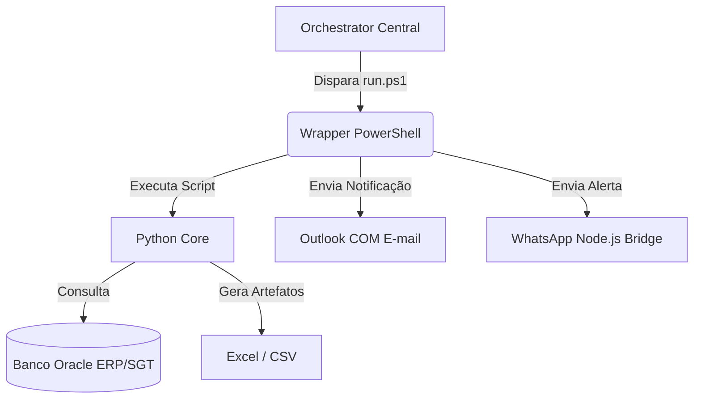

# Runbook Operacional: [Nome da Automação] (v[Versão])

[⬅️ Voltar para o Hub Central](../../README.md)

> [!NOTE]
> Este documento é o runbook oficial de operação e contingência da automação **[Nome da Automação]**.
> Em caso de incidentes na Control Tower ou falha crítica de execução, siga rigorosamente os procedimentos descritos abaixo.

---

## 📋 Ficha Técnica e Metadados

* **Componente / Diretório:** `[Caminho do Diretório, ex: Receitas Bloqueadas]`
* **Criticidade:** `[CRÍTICA / ALTA / MÉDIA / BAIXA]`
* **SLA de Recuperação:** `[Tempo de recuperação tolerado, ex: 2 horas]`
* **Horários de Disparo:** `[Horários cron, ex: Seg-Sex às 07:30, 10:00, 14:00]`
* **Dono do Negócio (Product Owner):** `[Nome / Setor, ex: Laboratório de Receitas / PCP]`
* **Desenvolvedor / Suporte Técnico:** `[Contato TI, ex: suporte.automacoes@empresa.com]`

---

## 🎯 Visão Geral e Impacto de Negócio

### O que esta Automação Faz?
`[Descreva de forma sucinta o fluxo de trabalho realizado pela automação e quem consome os seus resultados.]`

### Impacto de Parada (Risco Financeiro / Operacional)
`[O que acontece se este robô parar de funcionar por mais de X horas? Descreva as consequências operacionais, multas, atrasos de produção ou gargalos de expedição.]`

---

## 🛠️ Arquitetura e Dependências Técnicas

A automação opera de forma integrada com a seguinte pilha:



### 🗂️ Mapeamento de Arquivos e Recursos
* **Script de Inicialização:** `[run.ps1 / run.bat]`
* **Lógica Principal:** `[processar_receitas.py / extract_oracle.py]`
* **Arquivos de Configuração:** `[receitas_config.json / .env]`
* **Logs de Operação:** `[Logs/NomeDaAutomacao.log]`
* **Logs de Canais:** `[Logs/WhatsApp_Global.log]`

---

## 🚦 Matriz de Exit Codes e Resiliência

Esta automação classifica seus resultados de saída através de códigos de retorno padronizados para a Control Tower:

| Exit Code | Significado | Gravidade | Ação Imediata do Operador |
| :--- | :--- | :--- | :--- |
| **0** | Sucesso ou Supressão por Idempotência | info | Nenhuma ação requerida. Estado idêntico ou processado com êxito. |
| **1** | Erro Fatal / Crash de Runtime | CRÍTICO | Verificar erros de sintaxe Python, falta de memória ou dependências quebradas. |
| **3** | Erro de Negócio (ex: Banco de Dados offline) | ALTO | Verificar conectividade do Oracle. Conferir se a credencial não está expirada. |
| **9** | Falha de Pre-Flight Check | MÉDIO | Verificar se o diretório virtual `.venv` ou os arquivos de entrada necessários estão corrompidos. |
| **24** | Erro no Bridge do WhatsApp | MÉDIO | Verificar se o QR Code do WhatsApp Web está pareado no servidor de bridge Node.js. |
| **40** | Concorrência Bloqueada (Lock Ativo) | BAIXO | O processo anterior ainda está em execução ou o arquivo `.lock` ficou travado. |

---

## 🩺 Procedimentos de Troubleshooting (Resolução de Problemas)

### Cenário A: Falha na Conectividade com o Banco de Dados (Exit Code 3)
> [!IMPORTANT]
> A automação possui retry exponencial automático com `stamina` para quedas transitórias de rede. Falha definitiva após 3 tentativas indica problemas de infraestrutura ou credenciais.
1. **Passo 1:** Verifique os logs de banco de dados em `Logs/NomeDaAutomacao.log`. Procure por erros como `ORA-01017: invalid username/password` ou `ORA-12541: TNS: no listener`.
2. **Passo 2:** Valide se o `.env` local contém as credenciais corretas do Oracle.
3. **Passo 3:** Teste a conexão manual ao Oracle usando uma ferramenta de banco de dados (ex: DBeaver ou SQL Developer) na mesma máquina do Orquestrador.

### Cenário B: Erro no Envio via WhatsApp (Exit Code 24 / 40)
1. **Passo 1:** Analise os logs do canal no arquivo `Logs/WhatsApp_Global.log`.
2. **Passo 2:** Se o log apontar `Session closed` ou `Authentication failed`, execute o script de diagnóstico do WhatsApp:
   ```powershell
   powershell -ExecutionPolicy Bypass -File Tools/Test-LogConformidade.ps1
   ```
3. **Passo 3:** Se houver bloqueio de concorrência (`Exit Code 40`), verifique se existem processos fantasmas do Node ou do Chrome rodando em segundo plano e encerre-os:
   ```powershell
   Get-Process -Name "node", "chrome" | Stop-Process -Force
   ```
   Em seguida, remova manualmente o arquivo `.lock` temporário da pasta da automação, se existir.

### Cenário C: Erro no Envio via E-mail / Outlook
1. **Passo 1:** Certifique-se de que o Outlook está aberto com o perfil de e-mail correto configurado na máquina servidora.
2. **Passo 2:** Se a automação falhar na chamada COM, reinicie o Outlook e tente disparar novamente.

---

## 🔄 Fluxo de Recuperação (Requeue e Execução Manual)

Caso precise reexecutar a automação manualmente após a resolução de um incidente:

### 1. Via Dashboard Operacional (Recomendado)
1. Acesse o Dashboard em `http://localhost:8000/dashboard/`.
2. Navegue até a aba **Execuções** ou **Automações**.
3. Localize a execução com falha e clique no botão **Requeue** (Recomeçar Execução).
4. *Nota:* O orquestrador valida se já existe outra execução ativa para evitar duplicidade em recursos de grupo.

### 2. Via PowerShell (Emergência)
Se precisar disparar de forma independente fora do Orquestrador:
1. Abra um terminal do PowerShell como Administrador.
2. Navegue até o diretório da automação:
   ```powershell
   cd "C:\Automacoes\NomeDaAutomacao"
   ```
3. Execute o wrapper operacional:
   ```powershell
   .\run.ps1
   ```
4. Verifique o arquivo `Logs/NomeDaAutomacao.log` para confirmar a conclusão com sucesso (`Exit Code 0`).
